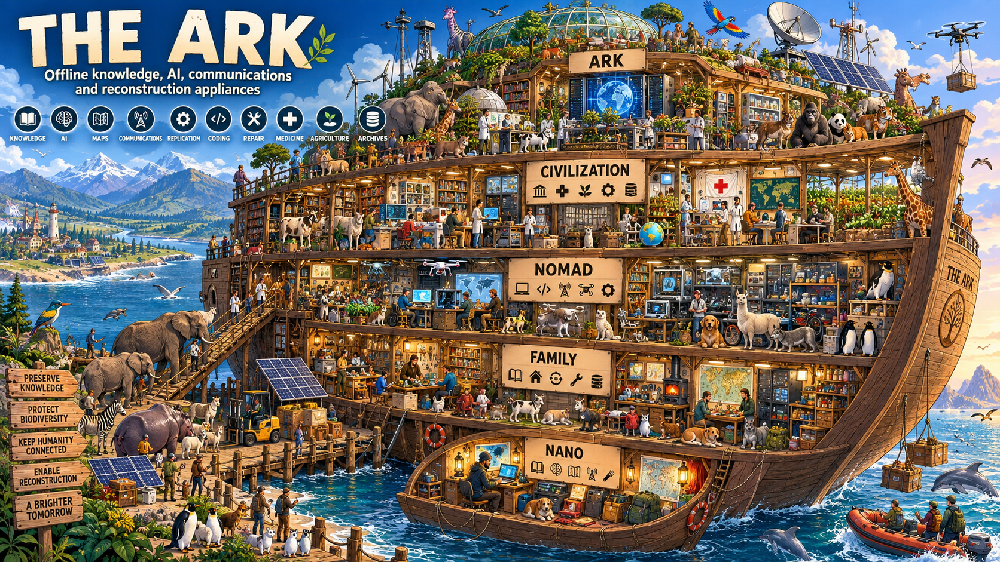
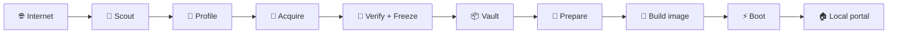

<div align="center">

<a href="docs/assets/the-ark-original.png">
  
</a>
<sub>Original generated artwork · 1672×941 · click for full resolution</sub>

# THE ARK

### The computer you can still use when the Internet is gone.

**Knowledge · AI · Maps · Communications · Repair · Coding · Reconstruction**

[](https://github.com/jandromani/endoftheworld/actions/workflows/nano-validate.yml)
[](https://github.com/jandromani/endoftheworld/actions/workflows/family-validate.yml)
[](https://github.com/jandromani/endoftheworld/actions/workflows/nomad-validate.yml)
[](https://github.com/jandromani/endoftheworld/actions/workflows/civilization-validate.yml)


**[🚀 I know nothing about Linux — start here](docs/guides/BEGINNER.md)** ·
**[🇪🇸 Guía para empezar desde cero](docs/es/EMPIEZA-AQUI.md)** ·
[How it works](docs/how-it-works.md) ·
[Project NOMAD inside](docs/project-nomad.md) ·
[What is still missing?](docs/frontiers.md)

</div>

---

## 👶 Explain it like I am five

Imagine that the Internet is a gigantic library, map room, software store and toolbox.

THE ARK builds a **small private copy of the useful parts** before you lose access to them.

It puts those things on an SSD:

- 📚 books and reference material;
- 🩺 medical knowledge;
- 🧠 an AI that runs on your own computer;
- 🎙️ speech recognition;
- 🗺️ maps;
- 📡 communications software;
- 🔧 repair and DIY knowledge;
- 💻 programming tools and source code;
- 📦 software dependencies;
- 🧊 a receipt telling you exactly what was saved and whether it changed.

Then THE ARK makes that SSD **bootable**.

You can plug it into a compatible PC, boot from it and open a local website. The important services run on the machine itself.

> **Internet is needed while building the Ark. Internet is not required to use the finished Ark.**

---

# 🚀 “I know nothing about computers. How do I use this?”

Start with **NANO**.

You need:

1. **A normal x86-64 PC running Debian/Ubuntu Linux** while you build it.
2. **Internet access during the build.**
3. **Free disk space for the download + the final image.**
4. **A spare SSD/USB drive** large enough for the profile.
5. Time: downloading large offline libraries can take a while.

> Windows/macOS are not direct image-builder targets yet. That is a frontier we still need to cross.

### The easy path

**Browser GUI (recommended):**

```bash
bash scripts/ark-gui.sh
```

It opens a local click-through builder on `127.0.0.1:8787`.

**Terminal wizard:**

Open a terminal and paste:

```bash
git clone https://github.com/jandromani/endoftheworld.git
cd endoftheworld
bash scripts/ark-wizard.sh
```

The wizard asks:

```text
Which Ark do you want?

1) NANO          64 GB   — knowledge + AI + Spain maps
2) FAMILY       256 GB   — NANO + sharing + local Git
3) NOMAD          1 TB   — developer workstation + Project NOMAD
4) CIVILIZATION   4 TB   — NOMAD + package closure + CAD/science/Europe

Choose 1-4:
```

It does **not** erase a drive without asking.

---

## 🧪 I only want to try it. Do I need to erase a disk?

No.

On a Linux PC:

```bash
make nano-acquire
make nano-prepare
make nano-verify
make nano-run
```

Then open:

**http://localhost:8080**

You will see the Ark portal while still using your normal operating system.

Stop it with:

```bash
make nano-stop
```

---

# 💽 I want the real bootable “end-of-the-world computer”

After the profile has been acquired and verified:

```bash
make nano-image
```

This creates:

```text
dist/endworld-nano-amd64.img
dist/endworld-nano-amd64.img.sha256
```

Find your spare disk:

```bash
lsblk -o NAME,SIZE,MODEL,TRAN,MOUNTPOINTS
```

Then flash it:

```bash
make nano-flash DEVICE=/dev/sdX
```

⚠️ **That drive will be erased.** The flash script shows the target and asks you to type the exact device path before writing.

Now:

1. shut down the target PC;
2. connect the Ark SSD;
3. enter BIOS/UEFI boot selection;
4. boot from that SSD;
5. wait for the node to start;
6. open **http://endworld-nano.local/** from another device on the same LAN, or connect to the Ark Wi-Fi if the hardware supports access-point mode.

Default console account in the current development image:

```text
user:     endworld
password: endworld
```

Change it after first boot:

```bash
passwd
```

The Wi-Fi defaults live in `config/<profile>.env` and should also be changed before use on an untrusted network.

**Full beginner guide → [docs/guides/BEGINNER.md](docs/guides/BEGINNER.md)**

---

# 🛟 Which Ark should I build?

| | Size | Imagine it as… | Best for |
|---|---:|---|---|
| 🛟 **NANO** | 64 GB | emergency backpack | first build, portable reference node |
| 🏠 **FAMILY** | 256 GB | house library/server | family files, stronger AI, local Git |
| 🧭 **NOMAD** | 1 TB | mobile workshop | developers, makers, field teams |
| 🏛️ **CIVILIZATION** | 4 TB | reconstruction workshop | package dependencies, CAD, science, Europe |
| 🛶 **ARK** | maximum | preservation network | planned multi-node preservation tier |

If you are unsure: **build NANO first**.

NANO teaches you the complete lifecycle with the smallest storage bill.

---

# 📦 What do we actually save?

| Thing | Format | Why it is there |
|---|---|---|
| Wikipedia / medicine / manuals | `.zim` | searchable offline library |
| Local AI models | `.gguf` | AI without a cloud API |
| Speech model | Whisper binary | local transcription |
| Raw maps | `.osm.pbf` | source map data |
| Ready maps | `.pmtiles` | fast local map viewer |
| Android apps | `.apk` | install useful tools without an app store |
| Device firmware | archives | recover/flash supported field devices |
| Software source | source `.tar.gz` | preserve code for rebuilding |
| Docker services | container `.tar` | start known services without a registry |
| APT/PyPI/npm closure | snapshot `.tar` | rebuild selected software without registries |
| Runtime web assets | JS/CSS/tools | make the local portal work |
| Lock file | JSON | exact receipt of what was saved |
| BOM | CycloneDX JSON | machine-readable inventory |

Personal files created **after** boot live in the mutable `state/` area and are deliberately separate from the frozen vault.

---

# 🧾 Manifest? Lock? Vault? Explain the strange words.

Think of packing an actual Ark:

| THE ARK word | Simple meaning |
|---|---|
| `manifests/capabilities.yml` | 🔭 **the radar** — interesting projects we watch |
| `profiles/nano.yml` | 📝 **the packing list** — what NANO must carry |
| `scripts/acquire.py` | 🛒 **the shopper** — downloads the packing list |
| `vault/nano/` | 📦 **the warehouse** — the actual downloaded content |
| `nano.lock.json` | 🧾 **the receipt** — exact URLs, versions, sizes and SHA-256 hashes |
| `nano.cdx.json` | 📋 **the inventory/BOM** — machine-readable list of the frozen box |
| `prepare` | 🧰 **the workshop** — turns raw things into usable things, e.g. OSM → PMTiles |
| `build-image` | 🧳 **packing the suitcase** — Debian + runtime + vault into one disk image |
| `flash` | 💽 **putting the suitcase on the SSD** |
| `runtime/` | 🕹️ **the control panel** — the portal and local services |
| `config/<profile>.env` | 🎛️ **the knobs** — Wi-Fi name, AI mode, ports/features |

The important distinction:

### The capability catalog is **not** the Ark.

`manifests/capabilities.yml` is what we are watching.

### The profile is the promise.

`profiles/<profile>.yml` says what that product should contain.

### The lock is the proof.

After acquisition, the lock records what was **actually resolved and frozen**.

Read the full walkthrough: **[How THE ARK works](docs/how-it-works.md)**.

---

# 🔁 What happens when I build it?



And the trust boundary is deliberately boring:

```text
Internet
   ↓
discover
   ↓
download as data
   ↓
verify / hash
   ↓
freeze exact artifact
   ↓
build a new Ark
   ↓
offline node
```

A field Ark does not silently mutate because an upstream `latest` tag changed.

---

# 🧭 Where does Project NOMAD fit?

**Project NOMAD is inside the larger Ark profiles.**

Project NOMAD is an offline-first browser-based **Command Center** that can orchestrate containerized tools and resources. Upstream, it includes concepts such as AI/RAG, Kiwix, Kolibri, maps, CyberChef, notes and a Supply Depot application catalog.

In THE ARK:

```text
THE ARK / ENDWORLD
│
├── decides WHAT is trusted and frozen
├── creates the bootable appliance
├── owns profile manifests + hashes + provenance
│
└── NOMAD / CIVILIZATION
     └── Project NOMAD Command Center
          ├── admin UI
          ├── MySQL
          ├── Redis
          └── local application orchestration
```

So they solve different layers:

- **THE ARK / ENDWORLD** = preservation, provenance, reproducibility, bootable image and trust boundary.
- **Project NOMAD** = human-friendly local command center and app orchestration.

We deliberately disable Project NOMAD's automatic updater inside a frozen Ark. New versions should enter through the Ark build pipeline instead.

Read: **[Project NOMAD inside THE ARK](docs/project-nomad.md)**.

---

# 🧠 What can I do after it boots?

From a phone/laptop on the local network you can open the portal and:

- search the offline library;
- ask local AI questions;
- transcribe audio locally;
- view offline maps;
- download preserved Android apps;
- inspect the exact frozen capability inventory.

FAMILY additionally exposes:

- Syncthing;
- Forgejo.

NOMAD/CIVILIZATION additionally expose:

- Qdrant;
- code-server;
- Project NOMAD;
- switchable general/coder AI;
- a native developer toolchain.

CIVILIZATION additionally preserves selected APT/PyPI/npm dependency closure and reconstruction-oriented CAD/science/GIS source ecosystems.

---

# 🧩 What are we still missing?

THE ARK already has working software profiles. The next frontier is making it **easier, more trustworthy, more complete and harder to kill**.

Instead of hiding 17 loose TODOs in this README, the remaining work is organized into **7 engineering epics**:

| Frontier epic | What a human gets | State | Track it |
|---|---|---|---|
| 🖱️ **Zero-touch Ark** | local browser builder + hardened first boot | 🟨 MVP shipped | [#8](https://github.com/jandromani/endoftheworld/issues/8) |
| 🔐 **Trusted Ark** | release manifest + detached signatures | 🟨 MVP shipped | [#9](https://github.com/jandromani/endoftheworld/issues/9) |
| 🔎 **Ask the whole Ark** | local FTS/RAG over docs, metadata and source | 🟨 MVP shipped | [#10](https://github.com/jandromani/endoftheworld/issues/10) |
| 📦 **Rebuild more software** | 7 ecosystems + verified offline update bundles | 🟨 MVP shipped | [#11](https://github.com/jandromani/endoftheworld/issues/11) |
| 🤝 **Arks can save Arks** | peer replication, deltas, multi-node final ARK | ⬜ next | [#12](https://github.com/jandromani/endoftheworld/issues/12) |
| 🔌 **Survive without normal infrastructure** | power telemetry + radio/beyond-IP workflows | ⬜ next | [#13](https://github.com/jandromani/endoftheworld/issues/13) |
| 🧪 **Prove it in the real world** | hardware matrix + repeated disconnected drills | ⬜ next | [#14](https://github.com/jandromani/endoftheworld/issues/14) |

<details>
<summary><strong>Show the full checklist of remaining frontiers</strong></summary>

- [ ] no-terminal desktop builder
- [ ] signed prebuilt images/releases
- [ ] Windows/macOS builder
- [ ] Secure Boot
- [ ] first-boot credential wizard
- [ ] one search over every library/code/doc
- [ ] automated local RAG ingestion
- [ ] Maven/Cargo/Go/OCI deeper closure
- [ ] offline update bundles/deltas
- [ ] Ark-to-Ark replication
- [ ] content-addressed deduplication
- [ ] UPS/solar/power layer
- [ ] deeper SDR/radio workflows
- [ ] multilingual portal/docs
- [ ] physical hardware matrix
- [ ] repeated disconnected recovery drills
- [ ] multi-node final ARK tier

</details>

**[Read the complete frontier map](docs/frontiers.md)** · **[See the roadmap](ROADMAP.md)**

---

# 🧪 What is actually proven today?

There are different kinds of “works”:

1. ✅ **repository complete** — files/wiring exist;
2. ✅ **CI tested** — profile contracts and acquisition paths are validated;
3. ✅ **live source resolution** — required current sources resolve;
4. ⬜ **full real payload acquired** — hundreds of GB/TB downloaded on a builder;
5. ⬜ **full raw image built**;
6. ⬜ **flashed and repeatedly booted on real hardware with WAN removed**.

Current software/CI profiles:

```text
NANO            64 GB     SURVIVE             ✅
FAMILY         256 GB     LIVE + SHARE        ✅
NOMAD            1 TB     REBUILD + CREATE    ✅
CIVILIZATION     4 TB     RECONSTRUCT         ✅
ARK            maximum    PRESERVE            🚧
```

We do not call a profile “physically field-proven” until the final offline hardware stages happen.

---

# 🛠️ For developers

Manual lifecycle:

```bash
make nano-plan
make nano-acquire
make nano-prepare
make nano-verify
make nano-selftest
make nano-run
make nano-image
make nano-flash DEVICE=/dev/sdX
```

CIVILIZATION inserts dependency snapshotting before preparation:

```bash
make civilization-acquire
make civilization-snapshot-packages
make civilization-prepare
```

NOMAD/CIVILIZATION AI modes:

```bash
make nomad-ai-lite
make nomad-ai-general
make nomad-ai-coder
```

---

# 📚 Documentation

**If you are new:** [Beginner guide](docs/guides/BEGINNER.md)

**If you want to understand the machine:** [How it works](docs/how-it-works.md)

**If you want to rebuild it from zero:** [Reconstruction guide](docs/reconstruction.md)

| Area | Docs |
|---|---|
| Start | [Beginner](docs/guides/BEGINNER.md) · [Español](docs/es/EMPIEZA-AQUI.md) · [FAQ](docs/guides/faq.md) |
| Mental model | [How it works](docs/how-it-works.md) · [Architecture](docs/architecture.md) · [Storage](docs/storage-model.md) |
| Trust | [Trust & verification](docs/trust-and-verification.md) · [Security](SECURITY.md) |
| Components | [Runtime](docs/runtime-services.md) · [AI](docs/ai.md) · [Networking](docs/networking.md) · [Developer mode](docs/developer-mode.md) |
| Project NOMAD | [How NOMAD sits inside THE ARK](docs/project-nomad.md) |
| Operations | [Build image](docs/guides/build-image.md) · [Offline operation](docs/guides/offline-operation.md) · [Troubleshooting](docs/guides/troubleshooting.md) |
| Reference | [CLI](docs/reference/cli.md) · [Environment](docs/reference/environment-variables.md) · [Ports](docs/reference/ports-and-services.md) |
| Future | [Frontiers](docs/frontiers.md) · [Roadmap](ROADMAP.md) |

---

# 🎨 Can the GitHub page have a custom background?

No. GitHub owns the repository page background and the user's light/dark theme.

What we **can** control inside the README:

- responsive images;
- different light/dark banners with `<picture>`;
- badges;
- HTML alignment/tables;
- collapsible `<details>`;
- Mermaid diagrams;
- SVG/PNG/JPG section artwork;
- anchors and a strong visual information hierarchy.

That keeps the repo native to GitHub instead of depending on fragile custom CSS.

---

# ❤️ The idea

A backup says:

> “I saved the files.”

THE ARK asks:

> **“Can I still use the knowledge, software and tools?”**

<div align="center">

## Preserve more than files.

### Preserve the ability to do things.

</div>
