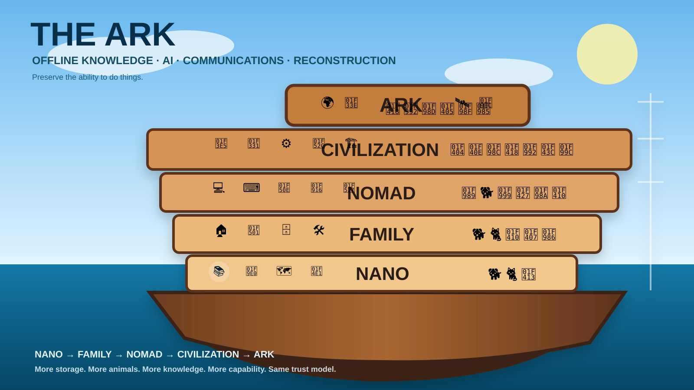

<div align="center">



# THE ARK

### Offline knowledge, AI, communications and reconstruction appliances

**Preserve knowledge · Keep local intelligence alive · Stay connected · Retain the ability to rebuild**

[](https://github.com/jandromani/endoftheworld/actions/workflows/nano-validate.yml)
[](https://github.com/jandromani/endoftheworld/actions/workflows/family-validate.yml)
[](https://github.com/jandromani/endoftheworld/actions/workflows/nomad-validate.yml)


[Why](#why-the-ark) · [Profiles](#the-fleet) · [Quickstart](#quickstart) · [Architecture](#architecture) · [Docs](#documentation) · [Roadmap](#roadmap)

</div>

---

## What is THE ARK?

**THE ARK** is a family of reproducible, offline-first appliances that acquire useful public knowledge and software while the Internet exists, verify and freeze it, then serve it locally when the Internet is unavailable.

The public project is **THE ARK**. The underlying control-plane and CLI remain named **ENDWORLD** for compatibility.

> **Internet is a build-time dependency, not a run-time dependency.**

A normal backup preserves files. THE ARK aims to preserve **capability**:

- 📚 searchable offline knowledge;
- 🧠 local language models;
- 🎙️ local speech-to-text;
- 🗺️ offline maps;
- 📡 field communications software and firmware;
- 🔁 peer-to-peer replication;
- 🧰 repair, DIY and survival references;
- 💻 source control, an IDE and developer toolchains;
- 🔎 vector-search infrastructure;
- 🧊 pinned provenance, hashes and immutable manifests;
- 💽 a reproducible BIOS/UEFI appliance image.

## Why THE ARK?

Modern technical capability has hidden runtime dependencies everywhere: cloud APIs, package registries, app stores, search engines, CDNs, container registries, documentation websites and SaaS control planes.

A folder full of PDFs is useful. A bootable node that can **search, reason, map, communicate, code, repair and replicate** is much more useful.

THE ARK is designed for:

- low-connectivity and remote environments;
- household resilience;
- field operations;
- education and labs;
- homelab sovereignty;
- disaster preparedness;
- long-lived technical archives;
- experiments in preserving enough tooling to rebuild useful systems.

It is **not** a claim that one SSD can preserve civilization. It is an engineering framework for deciding what to preserve, how to verify it and how to make it operational offline.

## The fleet

Each profile is a larger “deck” of the same Ark. The engine is shared; capability density increases.

| Profile | Target | Mission | AI | Extra services | Status |
|---|---:|---|---|---|---|
| 🛟 **NANO** | 64 GB | Survive & reference | Qwen3 4B | — | ✅ Software/CI implemented |
| 🏠 **FAMILY** | 256 GB | Live, share & preserve | Qwen3 8B | Syncthing, Forgejo | ✅ Software/CI implemented |
| 🧭 **NOMAD** | 1 TB | Rebuild & create | 8B + 30B general + 30B coder | Qdrant, code-server, Project NOMAD | ✅ Software/CI implemented |
| 🏛️ **CIVILIZATION** | multi-TB | Reconstruct systems | planned | package mirrors, CAD, science, infra | 🚧 Planned |
| 🛶 **ARK** | maximum | Preservation seed | planned | maximum curated preservation | 🚧 Planned |

Detailed product sheets:

- [NANO](profiles/nano/README.md)
- [FAMILY](profiles/family/README.md)
- [NOMAD](profiles/nomad/README.md)
- [CIVILIZATION](profiles/civilization/README.md)
- [ARK](profiles/ark/README.md)

## What is already inside?

### 📚 Knowledge

Kiwix/ZIM collections, Wikipedia, medical references, developer references, survival/repair material and profile-specific curated sources.

### 🧠 Local intelligence

llama.cpp provides a local OpenAI-compatible inference endpoint. NOMAD can switch between **lite**, **general** and **coder** models without changing the API used by the portal.

### 🎙️ Voice

whisper.cpp provides local transcription.

### 🗺️ Maps

Frozen OpenStreetMap extracts are transformed with Planetiler into PMTiles and served through a local MapLibre interface.

### 📡 Communications

The vault can preserve Bitchat, Meshtastic Android + firmware, Reticulum and supporting radio/mapping material.

### 💻 Developer sovereignty

FAMILY introduces Forgejo. NOMAD adds code-server, Qdrant and native C/C++, Python, Node, Java/Maven, Rust and Go toolchains, plus frozen developer references and source trees.

### 🧊 Trust boundary

Unknown upstream software is not silently promoted. The intended lifecycle is:

```text
Internet → Scout → Quarantine → Verify → Freeze → Prepare → Image → Offline node
```

## Architecture

```text
                         THE ARK
                            │
                    ENDWORLD control plane
                            │
          ┌─────────────────┼─────────────────┐
          │                 │                 │
       profiles          manifests          policy
          │                 │                 │
          └──────────── acquisition ──────────┘
                            │
                     verified frozen vault
                            │
              ┌─────────────┼─────────────┐
              │             │             │
          knowledge        AI           maps
              │             │             │
              ├──── apps / source / firmware ────┐
              │                                   │
              └──────────── runtime ──────────────┘
                            │
                  BIOS + UEFI appliance
```

See [Architecture](docs/architecture.md), [Trust & verification](docs/trust-and-verification.md) and [Storage model](docs/storage-model.md).

## Quickstart

### Clone

```bash
git clone https://github.com/jandromani/endoftheworld.git
cd endoftheworld
```

### Install builder prerequisites

```bash
make builder-deps
make setup
make doctor
```

### Build a profile

```bash
# choose nano, family or nomad
make nomad-plan
make nomad-acquire
make nomad-prepare
make nomad-verify
make nomad-selftest
```

### Run the prepared vault locally

```bash
make nomad-run
```

### Build a bootable image

```bash
make nomad-image
```

### Flash

> ⚠️ The target device is overwritten.

```bash
make nomad-flash DEVICE=/dev/sdX
```

Full guide: [docs/guides/quickstart.md](docs/guides/quickstart.md).

## NOMAD: switch the local brain

```bash
make nomad-ai-lite
make nomad-ai-general
make nomad-ai-coder
```

All modes remain behind the same local inference endpoint.

## Repository map

```text
profiles/       profile manifests + product READMEs
manifests/      tracked capability catalog
scripts/        acquisition, verification, preparation, image build, CLI
runtime/        portal, local services, networking, systemd integration
config/         runtime configuration by profile
docs/           architecture, guides, references and operating model
```

## Documentation

Start with the [documentation index](docs/README.md).

| Area | Documents |
|---|---|
| Vision | [Overview](docs/overview.md) · [Philosophy](docs/philosophy.md) |
| Design | [Architecture](docs/architecture.md) · [Storage](docs/storage-model.md) · [Trust](docs/trust-and-verification.md) |
| Runtime | [Services](docs/runtime-services.md) · [Networking](docs/networking.md) · [AI](docs/ai.md) · [Developer mode](docs/developer-mode.md) |
| Operations | [Quickstart](docs/guides/quickstart.md) · [Build image](docs/guides/build-image.md) · [Offline operation](docs/guides/offline-operation.md) · [Troubleshooting](docs/guides/troubleshooting.md) |
| Reference | [CLI](docs/reference/cli.md) · [Environment](docs/reference/environment-variables.md) · [Ports](docs/reference/ports-and-services.md) · [Capabilities](docs/reference/capability-catalog.md) |

Project governance:

- [CONTRIBUTING.md](CONTRIBUTING.md)
- [SECURITY.md](SECURITY.md)
- [CODE_OF_CONDUCT.md](CODE_OF_CONDUCT.md)
- [ROADMAP.md](ROADMAP.md)
- [CHANGELOG.md](CHANGELOG.md)

## Verification status

NANO, FAMILY and NOMAD have repository/CI validation covering profile contracts, source resolution, acquisition logic, runtime routing and shared engine regressions.

That is intentionally different from **physical field validation**. A profile is only field-proven after its real payload has been acquired, its full-size image has been built and flashed, and the target machine has been repeatedly booted and exercised without WAN connectivity.

See the acceptance documents already in `docs/`.

## Security posture

THE ARK prefers boring trust rules:

1. download into quarantine;
2. record provenance;
3. verify checksums when upstream provides them;
4. hash everything locally;
5. pin/freeze what is promoted;
6. separate immutable vault content from mutable runtime state;
7. avoid “latest” at field-runtime;
8. rebuild intentionally.

Project NOMAD's updater sidecar is deliberately excluded from the ENDWORLD NOMAD runtime. New upstream versions go through the Ark lifecycle instead.

## Roadmap

```text
NANO          64 GB      SURVIVE             ✅
FAMILY       256 GB      LIVE + SHARE        ✅
NOMAD          1 TB      REBUILD + CREATE    ✅
CIVILIZATION  multi-TB   RECONSTRUCT         🚧
ARK           maximum    PRESERVE            🚧
```

See [ROADMAP.md](ROADMAP.md).

## Contributing

The highest-value contributions are not “add 500 random downloads”. They are well-argued, maintainable capabilities with provenance, a budget, an offline use case and an acceptance path.

Read [CONTRIBUTING.md](CONTRIBUTING.md) before proposing a capability or profile.

## Acknowledgements

THE ARK integrates or preserves work from many upstream communities, including Kiwix, OpenStreetMap, Planetiler, PMTiles, MapLibre, llama.cpp, whisper.cpp, Syncthing, Forgejo, Qdrant, code-server, Project NOMAD, Reticulum, Meshtastic and others. Their respective licenses and attribution requirements remain authoritative.

---

<div align="center">

### Preserve more than files.

**Preserve the ability to do things.**

</div>
